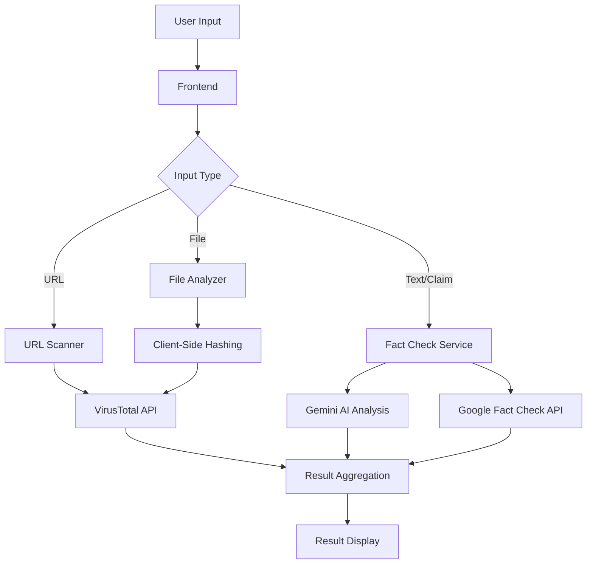

# SacchAi

SacchAi is a powerful, privacy-focused intelligence platform that helps users detect and combat digital threats including misinformation, financial fraud, and synthetic media (deepfakes). Built with modern web technologies, it provides real-time analysis using cutting-edge AI while maintaining user privacy.

## 🚀 Key Features

### 1. Fact Verification Engine
- **Real-time Fact Checking**: Instantly verify claims using Google's Fact Check Tools API and Gemini's reasoning
- **Source Analysis**: Get detailed source credibility assessments and cross-referenced information
- **Claim Classification**: Clear verdicts (True/False/Uncertain) with confidence scores and supporting evidence

### 2. Scam & Fraud Detection
- **Phishing Detection**: AI-powered analysis of emails and messages for scam indicators
- **URL Safety Check**: Scan website links against VirusTotal's threat database
- **File Security**: Client-side hash generation for file verification without uploading your files

### 3. Deepfake & Media Analysis
- **Multi-Format Support**: Analyze images, audio, and video files
- **AI-Generated Content Detection**: Identify potential deepfakes and synthetic media
- **Technical Artifact Analysis**: Detect inconsistencies in media that may indicate manipulation

### 4. Voice-Enabled Assistant
- **Natural Language Processing**: Interact using voice commands or text
- **Real-time Responses**: Get instant answers to your security queries
- **Multi-language Support**: Works with multiple languages through Gemini's capabilities

## 🏗️ System Architecture

SacchAi is built with a modern, client-side focused architecture that prioritizes security and performance. The system is composed of several key components that work together to provide a seamless user experience.

### Frontend Layer
- **React 19 with TypeScript**: For building a responsive and type-safe user interface
- **State Management**: React Context API for global state management
- **UI Components**: Built with Tailwind CSS for a modern, responsive design
- **Client-Side Processing**: All sensitive operations (like file hashing) happen in the browser

### AI Services
- **Google Gemini 2.5**: Powers natural language understanding and generation
- **Fact Checking**: Integrates with Google Fact Check Tools API
- **Media Analysis**: Advanced algorithms for detecting AI-generated content

### Security Layer
- **VirusTotal Integration**: For URL and file scanning
- **Client-Side Hashing**: Files are hashed locally before any processing
- **Secure API Communication**: All external API calls are encrypted

### Data Flow


## 🔄 User Workflow

### 1. Fact Verification Flow
1. **User Input**: User submits a claim or statement
2. **API Integration**:
   - Query Google Fact Check Tools API
   - Perform web search for additional context
3. **Analysis**: Gemini AI evaluates the claim against multiple sources
4. **Result**: Returns a verdict with confidence score and evidence

### 2. Security Scanning Flow
1. **Input Submission**: User uploads a file or submits a URL
2. **Client-Side Processing**:
   - Files are hashed locally (never uploaded)
   - URLs are sanitized and validated
3. **Threat Analysis**:
   - Check against VirusTotal's database
   - Analyze for phishing indicators
4. **Report Generation**: Detailed security assessment with recommendations

### 3. Media Analysis Flow
1. **Media Upload**: User uploads an image, audio, or video
2. **Feature Extraction**: Analyze media for AI-generated artifacts
3. **Deepfake Detection**:
   - Check for visual/audio inconsistencies
   - Analyze metadata and compression artifacts
4. **Result**: Generate a report on media authenticity

## 🛠️ Technology Stack

- **Frontend Framework**: React 19 with TypeScript
- **Styling**: Tailwind CSS for responsive design
- **AI Integration**: Google Gemini 2.5 for natural language and media analysis
- **Security**: Client-side hashing, secure API key handling
- **Build Tool**: Vite for fast development and production builds
- **Package Manager**: npm/yarn

## 🚀 Getting Started

### Prerequisites
- Node.js (v18 or higher)
- npm (v9.x or higher) or yarn (v1.22.x or higher)
- API keys for Google Gemini and VirusTotal

### Installation

1. **Clone the repository**
   ```bash
   git clone https://github.com/your-username/sacch-ai.git
   cd sacch-ai
   ```

2. **Install dependencies**
   ```bash
   npm install
   # or
   yarn install
   ```

3. **Configure environment variables**
   Copy the `.env.example` file to `.env` and update it with your API keys:
   ```bash
   cp .env.example .env
   ```
   
   Then edit the `.env` file to add your API keys:
   ```env
   # Google Gemini API Key (Required for AI interactions)
   GEMINI_API_KEY=your_google_gemini_api_key_here
   
   # Google Fact Check API Key (Required for fact checking)
   FACT_CHECK_API_KEY=your_google_fact_check_api_key_here
   
   # VirusTotal API Key (Required for URL/File scanning)
   VIRUSTOTAL_API_KEY=your_virustotal_api_key_here
   ```

4. **Start the development server**
   ```bash
   npm run dev
   # or
   yarn dev
   ```
   The application will be available at `http://localhost:3000`

5. **Build for production**
   ```bash
   npm run build
   # or
   yarn build
   ```

## 🔑 Obtaining API Keys

### Google Gemini API
1. Visit [Google AI Studio](https://aistudio.google.com/)
2. Sign in with your Google account
3. Create a new project or select an existing one
4. Enable the following APIs for your project:
   - Google AI Gemini API
   - Google Search API (for web search functionality)
5. Generate an API key in the API Keys section
6. Copy the API key and add it to your `.env` file as `GEMINI_API_KEY`

### Google Fact Check Tools API
1. Go to [Google Cloud Console](https://console.cloud.google.com/)
2. Select or create a project
3. Enable the "Fact Check Tools API"
4. Go to Credentials
5. Create an API key
6. Copy the API key and add it to your `.env` file as `FACT_CHECK_API_KEY`

### VirusTotal API
1. Sign up at [VirusTotal](https://www.virustotal.com/)
2. Navigate to your profile settings
3. Find your API key in the API Key section

## 🖥️ Usage Guide

### Verifying Information
1. Navigate to the Fact Check section
2. Enter the claim or statement you want to verify
3. View the analysis results, including confidence level and sources

### Scanning for Scams
1. Go to the Scam Detector
2. Paste a suspicious URL or upload a file
3. Review the security analysis and threat assessment

### Analyzing Media
1. Select the Media Analysis tool
2. Upload an image, audio, or video file
3. Get insights into potential manipulations or AI-generated content

## 🔒 Privacy & Security

- All file analysis is performed client-side using cryptographic hashing
- No personal data is stored or logged
- API keys are never sent to any server except their respective services
- The application follows security best practices for web applications

## 📚 Documentation

For detailed API documentation and advanced usage, please refer to:
- [Google Gemini API Documentation](https://ai.google.dev/docs/)
- [VirusTotal API v3 Documentation](https://developers.virustotal.com/reference/overview)

## 🤝 Contributing

Contributions are welcome! Please read our [Contributing Guidelines](CONTRIBUTING.md) for details on our code of conduct and the process for submitting pull requests.

## 📄 License

This project is licensed under the MIT License - see the [LICENSE](LICENSE) file for details.

## 🙋‍♂️ Support

For support, questions, or feature requests, please [open an issue](https://github.com/your-username/sacch-ai/issues).
